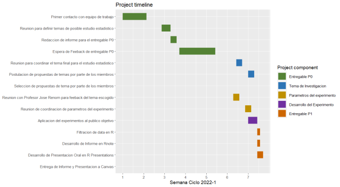
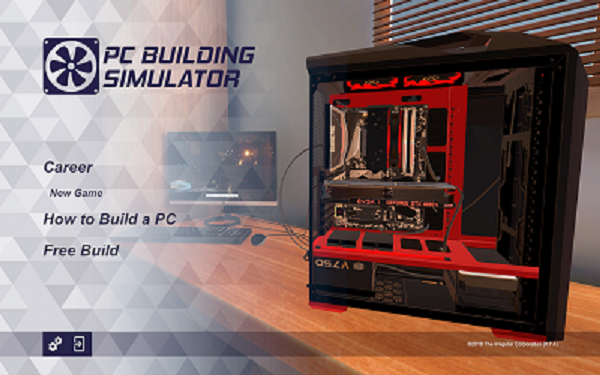
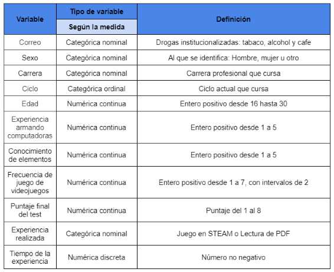
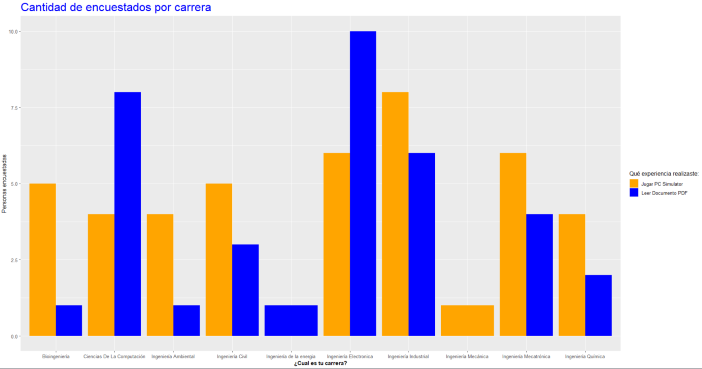
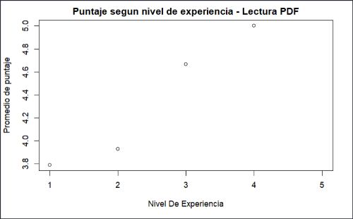
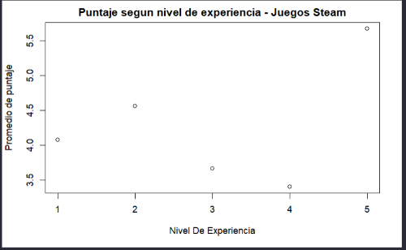
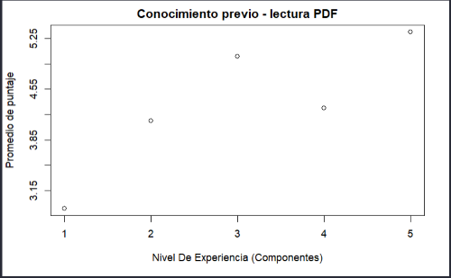
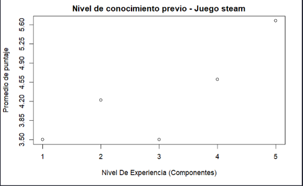
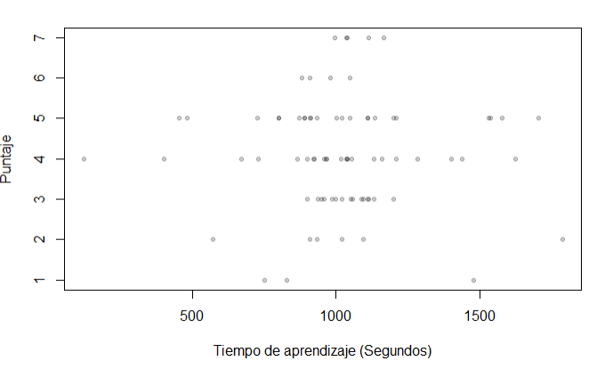
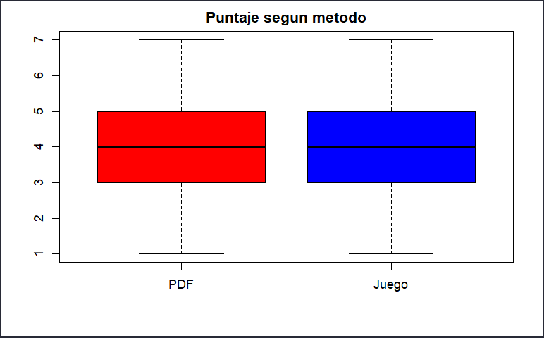

```{r setup, include=FALSE}
knitr::opts_chunk$set(echo = FALSE)
library(readr)
library(dplyr)
```

# Introducción

## Relevancia del tema{.smaller}

+ La gamificación de la educación es el uso de las mecánicas de los juegos en el ambiente educativo
+ La educación y los juegos tienen mucho en común.
+ La diferencia se da en cómo se enseñan dichas mecánicas y cómo se recompensa o castiga el aprendizaje de las mismas
+ El objetivo del estudio es analizar la posibilidad de transformar dichas mecánicas, su eficacia y su viabilidad.
 
 <center>


</center>

## Planificación




# Datos

## Experiencia 1: PC Building Simulator (juego en STEAM)

<center>

 

</center>

## Experiencia 2:  Enseñanza tradicional

<center>


</center>

## Población, muestra y muestreo

- Población: Estudiantes universitarios del Perú.
- Unidad muestral: Estudiante de la Universidad de Ingeniería y Tecnología - UTEC.
- Tamaño de la muestra:  79 estudiantes de UTEC
- Representatividad de la muestra: El tipo de muestreo es el aleatorio simple (MAS)

<center>


</center>


## Variables

<center>



</center>

# Análisis descriptivo

## Encuestados por carrera



## Experiencia armando computadoras `PDF` {.smaller}

+ Promedio de nivel 1: 4.1
+ Promedio de Nivel 2: 5.2
+ Promedio de nivel 3: 4.0
+ Promedio de nivel 4: 4.0
+ Promedio de nivel 5: 6.0



## Experiencia armando computadoras `PC` {.smaller}

+ Promedio de nivel 1: 3.000
+ Promedio de Nivel 2: 3.909
+ Promedio de nivel 3: 4.500
+ Promedio de nivel 4: 4.333
+ Promedio de nivel 5: NA



## Conocimiento de componentes `PDF` {.smaller}

+ Promedio de nivel 1: 3.000
+ Promedio de Nivel 2: 4.667
+ Promedio de nivel 3: 3.375
+ Promedio de nivel 4: 5.285
+ Promedio de nivel 5: 6.000



## Conocimiento de componente `PC` {.smaller}

+ Promedio de nivel 1: 2.750
+ Promedio de Nivel 2: 4.167
+ Promedio de nivel 3: 4.750
+ Promedio de nivel 4: 3.500
+ Promedio de nivel 5: 4.500



## Puntaje del test final 




## Puntaje PDF vs PC



# Gracias
